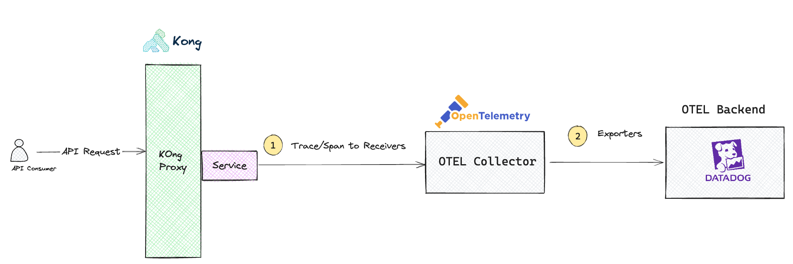
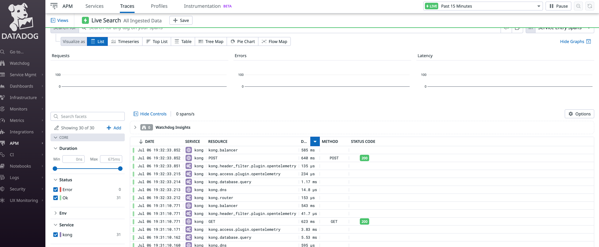

# Kong OpenTelemetry Integration with Datadog

Kong's OpenTelemetry integration with Datadog via OTEL Collector



## Setting Up

Create your own .env file and provide the required values. They are required to run the containers.

Please retrieve the Datadog API Key from your organsation settings. You can find the instructions here - [DataDog Account Management](hhttps://docs.datadoghq.com/account_management/api-app-keys/)

```
DD_API_KEY=
POSTGRES_PASSWORD=
```

### Enterprise License Loading (Optional)

For Kong enterprise users, you can load the license by sending a request Kong Admin API

```
http POST :8001/licenses \
  payload='LICENSE_KEY'
```

### Datadog Configuration

Configuration can be found in ./config/collector.yaml

## Starting Up

The docker compose will spin up Kong Gateway, Postgres and OTEL Colletor

1. Start Docker Compose 
```
docker-compose up -d
```

2. Tear-down
```
docker-compose down
```


## Configuration 

### Create Demo Service and Route

```
http :8001/services url=https://mockbin.org/request name=ot-demo

http :8001/services/ot-demo/routes name=ot-route expression='(http.path ^= "/ot2" || http.path ^= "/ot1")'
```

### Enable Kong OTEL Plugin

```
curl -X POST http://localhost:8001/plugins/ \
	--data "name=opentelemetry"  \
	--data "config.endpoint=http://otelcol:4318/v1/traces" \
	--data "config.batch_span_count=200" \
	--data "config.batch_flush_delay=3"

```

### Testing

```
http POST :8000/ot1 "X-Foo:hello OT1"
http GET :8000/ot2 "X-Foo:hello OT2"
```

You should see the trace coming in your DataDog dashboard




## References

1. [Kong Open Telemetry Plugin](https://docs.konghq.com/hub/kong-inc/opentelemetry/)
2. [DataDog OTEL Collector Set-up](https://docs.datadoghq.com/opentelemetry/otel_collector_datadog_exporter/?tab=onahost/)
